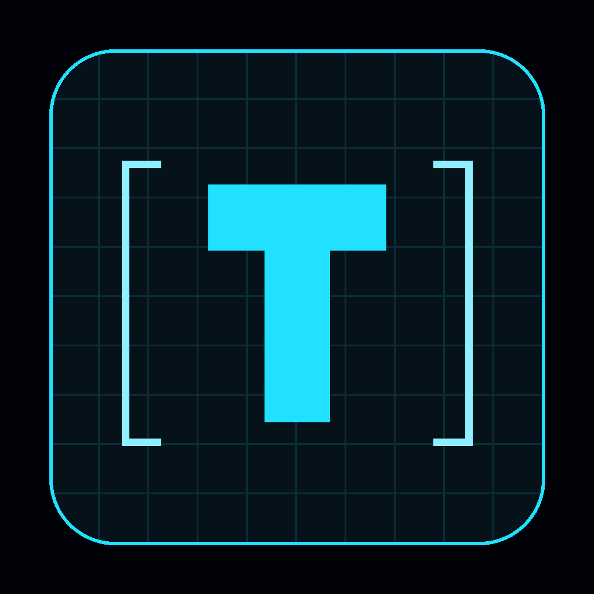
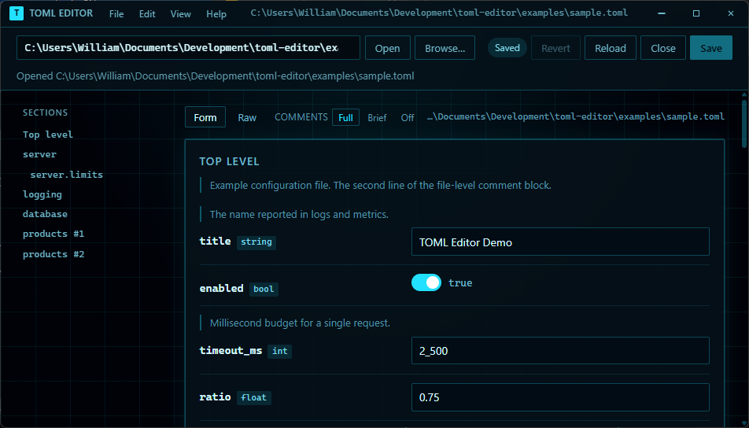
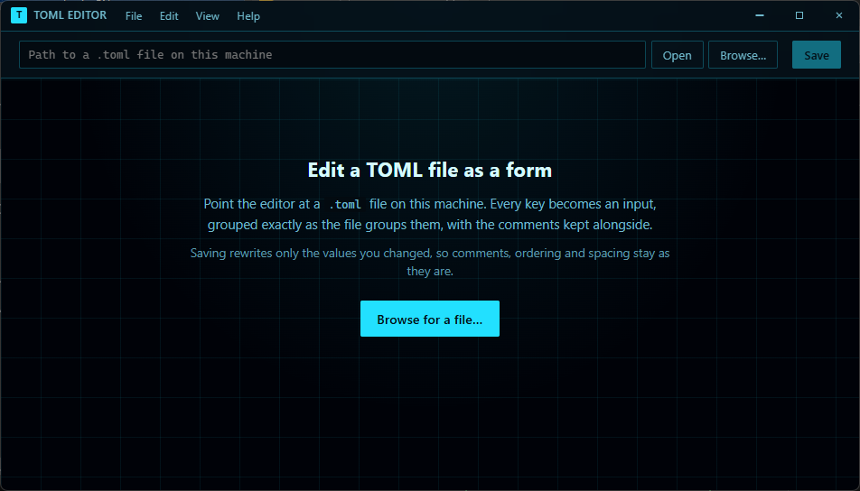

<div align="center">



# TOML Editor

**Edit a TOML file as a form. Save it back without touching a byte you didn't change.**

[](https://github.com/wlwatkins/toml-editor/releases/latest)
[](https://github.com/wlwatkins/toml-editor/releases)
[](https://github.com/wlwatkins/toml-editor/releases/latest)
[](https://toml.io/en/v1.0.0)
[](#private-by-construction)
[](LICENSE)

[](https://svelte.dev)
[](https://www.electronjs.org)
[](https://www.typescriptlang.org)

<br>



<sub>Every key becomes a control, every section a card, and every comment from the file sits beside the key it describes. Note the <code>2_500</code>: number formatting is kept exactly as written.</sub>

<br><br>

[**Download the installer**](https://github.com/wlwatkins/toml-editor/releases/latest) · [Features](#features) · [What saving actually does](#what-saving-actually-does) · [Comments](#comments)

</div>

---

## Why

Config GUIs usually have one fatal flaw: they parse the file into an object,
let you edit the object, and write the object back out. Comments vanish, keys
get re-ordered, `2_500` becomes `2500`, and the diff for a one-line change is
the whole file.

TOML Editor does not rebuild the file. It records where every value sits in
the original text and, on save, **replaces only the characters of the values
you changed**. Edit two fields in a 400-line config and you get a two-line diff.

## Features

- **The right control for every key.** Text boxes, number fields, toggles,
  date and time pickers, list editors for arrays, nested fields for inline
  tables. Sections become cards, nested by path depth, with an outline pinned
  beside the content for jumping around.
- **Comments are first-class.** Each comment is shown next to the key or section
  it belongs to and rendered as Markdown: headings, banners, lists, code, links.
  Long blocks fold to their first line. Nothing is dropped, not even a note
  sitting on its own between blank lines.
- **Saving is surgical.** Comments, key order, blank lines, number formatting,
  quoting style and alignment survive byte for byte.
- **Validated as you type.** An invalid integer or date is flagged inline and
  blocks saving, so the file never receives something that will not parse.
- **Raw view before you commit.** The **Raw** tab shows the exact text Save will
  write.
- **Safe on disk.** Writes are atomic, external edits are detected and refused
  with a conflict message, and only `.toml`/`.tml` paths can be opened or
  written, so a mistyped path fails loudly rather than clobbering something else.
- **A proper desktop app.** Frameless window, native Open dialog, an
  "open with" entry for `.toml` files, and a file path accepted on the command
  line.
- **Keeps itself current.** On start-up it quietly asks GitHub for a newer
  release and, if there is one, offers it. Nothing downloads until you say so,
  and a downloaded update installs on the next restart. **Help -> Check for
  updates…** does it on demand.

### Private by construction

It runs entirely on your machine. There is no server and no telemetry, and
nothing is uploaded anywhere. The only network request it ever makes is the
update check against this repository's GitHub releases.

## Installing it

Grab `TOML-Editor-Setup-<version>.exe` from the
[latest release](https://github.com/wlwatkins/toml-editor/releases/latest).
It installs per-user with no admin prompt, lets you choose the folder, and adds
Start menu and desktop shortcuts. Passing a file on the command line works too:

```
"TOML Editor.exe" C:\path\to\config.toml
```

<div align="center">

<br>
<sub>Launch it, type or browse to a path, and the form appears.</sub>
</div>

## What you can edit

| TOML                     | Control                                        |
| ------------------------ | ---------------------------------------------- |
| String                   | Text box, or a textarea for multi-line values  |
| Integer / float          | Number input (text, for hex/octal/underscored) |
| Boolean                  | Toggle                                         |
| Local date / time        | Native date and time pickers                   |
| Local date-time          | Native date-time picker                        |
| Offset date-time         | Text box (no browser control keeps the zone)   |
| Array                    | List editor: edit, reorder and add/remove items |
| Inline table `{ a = 1 }` | Nested fields, patched in place                |
| `[table]`, `[[array]]`   | A section card each, nested by path depth      |

**Close** (File -> Close file, or Ctrl+W) puts the editor back to its empty
state. With unsaved changes it asks first, naming how many would be lost; the
path stays in the location bar so the file is one click away again.

### Not supported

Adding or removing **keys and sections**. The form edits the values of what is
already in the file; array items are the exception and can be added and
removed. Restructuring a file is still a text-editor job.

## What saving actually does

The parser turns TOML into a tree where every value remembers its exact
character range in the original text. A save replaces **only the ranges whose
values you changed**. Everything else survives byte for byte:

- comments, both on their own line and trailing a value
- key order, blank lines and section order
- number formatting such as `2_500`, `0xff`, `1e6`
- quoting style: `'literal'` stays literal, `"""multi-line"""` stays multi-line
- your alignment, e.g. `host = "127.0.0.1"   # bind address`

A value edited back to its original text produces no change at all. Arrays are
the one exception: when items are added, removed or reordered the whole array
is re-rendered, since new items have no original text.

Two other safeguards:

- **Writes are atomic.** The new text goes to a temp file which is then renamed
  over the original, so an interrupted save cannot truncate your config.
- **External edits are detected.** If the file changed on disk after you opened
  it, saving is refused with a conflict message instead of overwriting the
  newer version.

## Comments

Comments are rendered as Markdown, because that is how people already write
them. A block like this:

```toml
# ---------------------------------------------------------------------------
# The parts
# ---------------------------------------------------------------------------
# What this instrument is made of, each named once. Every path is relative to
# THIS file, so the whole `config` tree can be moved or checked out anywhere
# without editing a line of it.
```

comes out as a rule, a heading and a paragraph, with `config` set as code. The
supported subset is headings (`##` in the file, since the first `#` is the
comment marker), the rule-title-rule banner style above, bullet and numbered
lists, block quotes, fenced and indented code, and inline code, **bold**,
*italic*, ~~strikethrough~~ and links.

Any block longer than two lines gets a disclosure triangle. The **Comments**
control in the toolbar sets the default for the whole file, and the choice is
remembered between sessions:

| Mode      | Effect                                        |
| --------- | --------------------------------------------- |
| **Full**  | everything expanded                           |
| **Brief** | every long block folded to a one-line summary |
| **Off**   | comments hidden entirely                      |

Comment text is escaped before any markup is generated, so nothing in a file
can turn into live HTML; a `<script>` in a comment is displayed as the text it
is. A link is only made clickable for `http`, `https` and `mailto`.

Comments the editor cannot attach to a specific key, such as a banner at the
top of the file or a note sitting on its own between blank lines, are kept and
shown above whatever follows them rather than dropped.

## Look

The editor wears **Grid**: neon cyan on black, hairline borders that glow, a
perspective grid on the backdrop and translucent panels that read as edge-lit
glass. Everything the OS normally provides still works in the frameless
window: edge-drag resizing, Aero Snap, double-click to maximise and Win+Arrow.

## License

[GPL-3.0](LICENSE). Use it at home or at work, on as many machines as you
like, and modify it freely. If you redistribute it, in original or modified
form, you must pass on the source code and the same freedoms to whoever
receives it.

---

<div align="center">
<sub>Built with Svelte 5, SvelteKit 2 and Electron. Source and issues on <a href="https://github.com/wlwatkins/toml-editor">GitHub</a>.</sub>
</div>
